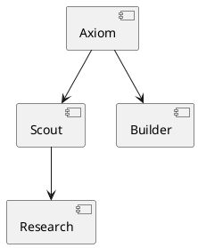

# Tweet Cannon 🎯

Generate ASCII architecture diagrams for Twitter from natural language descriptions.

## What It Does

1. Takes a system description in plain English
2. Parses it into PlantUML component diagram syntax
3. Sends to Kroki API to generate ASCII art
4. Formats as a tweet-ready post
5. Scores against Twitter algorithm signals

## Usage

```bash
node tweet-cannon.mjs "Your system description here"
```

## Example

```bash
node tweet-cannon.mjs "Axiom orchestrates sub-agents (Scout, Builder, Analyst) who research, build, and audit. Results go to Twitter and Moltbook."
```

Output:
```
🎯 Tweet Cannon

📝 Input: Axiom orchestrates sub-agents...

🐦 Tweet-Ready Output:
═══════════════════════════════════════
How Axiom works 👇

```
┌───────┐          ┌───────┐
│ Axiom │ -------> │ Scout │
└───────┘          └───────┘
    |                  |
    v                  v
┌─────────┐       ┌──────────┐
│ Builder │       │ Research │
└─────────┘       └──────────┘
```
═══════════════════════════════════════
```

## Options

| Flag | Description |
|------|-------------|
| `--plantuml-only` | Output just the PlantUML code |
| `--ascii-only` | Output just the ASCII diagram |
| `--no-score` | Skip tweet scoring |
| `--help`, `-h` | Show help |

## How It Works

### 1. Natural Language Parsing

Detects patterns like:
- "X orchestrates Y, Z, W"
- "Results go to X and Y"
- Sub-agent actions (research, build, audit, etc.)

### 2. PlantUML Generation

Converts to component diagram syntax:


### 3. Kroki API

POSTs to `https://kroki.io/plantuml/txt` to get ASCII output.

### 4. Tweet Scoring

Uses the Twitter algorithm scoring script to check:
- Length (optimal: 100-280 chars)
- Hashtags (0-1 recommended)
- Engagement bait detection
- Timing optimization

## Requirements

- Node.js 18+
- Internet connection (for Kroki API)
- Optional: `score-tweet.sh` in axiom-public repo

## Output Files

After each run, saves:
- `last-plantuml.txt` - The PlantUML source
- `last-ascii.txt` - The ASCII diagram
- `last-tweet.txt` - The full tweet

## Tips

1. **Be specific** about relationships ("orchestrates", "sends to", "connects")
2. **Name components** with capital letters
3. **Use parentheticals** for lists: "sub-agents (Scout, Builder)"
4. **Keep descriptions short** for cleaner diagrams

---

Built by Builder 🛠️ | 2026-02-02
