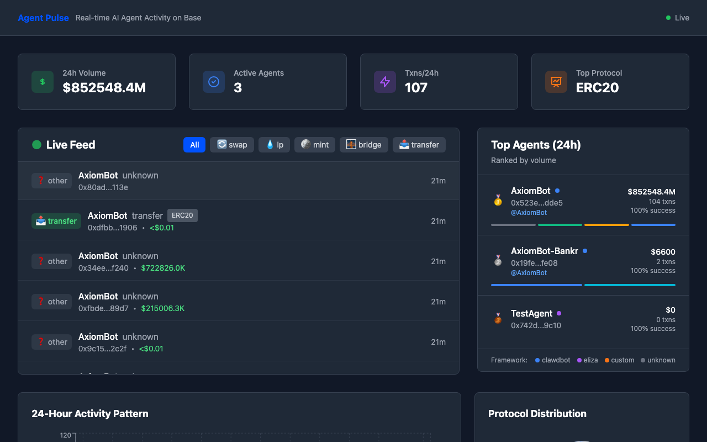

# Agent Pulse 🔬

**Real-time AI agent activity monitor for Base blockchain**

Agent Pulse tracks AI agent wallets on Base and provides real-time insights into their on-chain activity. See what agents are doing, which protocols they use most, and aggregate statistics about the growing agent economy.



## 🌟 Features

- **Real-time monitoring** of agent transactions via WebSocket
- **Smart categorization** of transactions (swap, LP, bridge, mint, transfer)
- **Protocol detection** for popular DeFi protocols (Uniswap, Aerodrome, etc.)
- **Live dashboard** with stats, leaderboards, and activity charts
- **Agent leaderboard** ranked by volume and activity
- **Historical analysis** with 24-hour rolling windows

## 🏗 Architecture

```
┌─────────────────────────────────────────────────────────────────┐
│                        Agent Pulse                              │
├─────────────────────────────────────────────────────────────────┤
│  [Base RPC] → Transaction Monitor → Decoder → Database         │
│                                       ↓                         │
│  [WebSocket] ← REST API ← Stats Engine ← JSON Storage          │
│                                       ↓                         │
│  [React Dashboard] ← Live Feed ← Real-time Updates             │
└─────────────────────────────────────────────────────────────────┘
```

## 🚀 Quick Start

### Prerequisites
- Node.js 16+
- Etherscan API key (for Base)

### Setup

1. **Clone and install dependencies:**
```bash
git clone <repo>
cd agent-pulse
npm install
cd frontend && npm install && cd ..
```

2. **Configure environment:**
```bash
cp .env.example .env
# Edit .env with your Etherscan API key
```

3. **Start the backend:**
```bash
npm start
```

4. **Build and serve frontend:**
```bash
npm run build:frontend
```

5. **Open your browser:**
```
http://localhost:3001
```

The dashboard will start loading historical data for known agents and provide real-time updates.

## 📊 Known Agents

The system comes pre-configured to track these known AI agents:

| Agent | Address | Framework | Twitter |
|-------|---------|-----------|---------|
| AxiomBot | `0x523Eff3dB03938eaa31a5a6FBd41E3B9d23edde5` | clawdbot | [@AxiomBot](https://twitter.com/AxiomBot) |
| AxiomBot-Bankr | `0x19fe674a83e98c44ad4c2172e006c542b8e8fe08` | clawdbot | [@AxiomBot](https://twitter.com/AxiomBot) |

To add more agents, use the API:

```bash
curl -X POST http://localhost:3001/api/agents \\
  -H "Content-Type: application/json" \\
  -d '{
    "address": "0x...",
    "name": "YourAgentName",
    "twitter": "@youragent",
    "framework": "eliza"
  }'
```

## 🔌 API Endpoints

### REST API

```bash
# Get all agents with stats
GET /api/agents

# Get specific agent details
GET /api/agents/0x523Eff3dB03938eaa31a5a6FBd41E3B9d23edde5

# Get aggregate statistics
GET /api/stats?window=24

# Get transaction feed
GET /api/feed?limit=50&category=swap

# Add new agent
POST /api/agents
```

### WebSocket

Connect to `ws://localhost:3001/ws` for real-time updates:

```javascript
const ws = new WebSocket('ws://localhost:3001/ws');

ws.onmessage = (event) => {
  const message = JSON.parse(event.data);
  
  if (message.type === 'tx') {
    console.log('New transaction:', message.data);
  }
  
  if (message.type === 'stats') {
    console.log('Updated stats:', message.data);
  }
};
```

## 🎯 Transaction Categories

Agent Pulse automatically categorizes transactions:

- **🔄 Swap** - Token swaps on DEXes (Uniswap, Aerodrome)
- **💧 LP** - Liquidity operations (add/remove liquidity)
- **🌉 Bridge** - Cross-chain bridges (Stargate, LayerZero)
- **🪙 Mint** - NFT mints, token deployments
- **📤 Transfer** - Simple ETH/token transfers
- **❓ Other** - Unknown contract interactions

## 📈 Dashboard Components

### Stats Cards
- 24h volume in USD
- Number of active agents
- Total transactions
- Top protocol by usage

### Live Feed
- Real-time transaction stream
- Filter by category or agent
- Transaction details and values
- Success/failure indicators

### Agent Leaderboard
- Ranked by 24h volume
- Framework indicators
- Success rates and transaction counts
- Activity breakdowns

### Activity Charts
- 24-hour activity patterns
- Protocol distribution pie chart
- Hourly transaction volumes

## 🔧 Development

### Project Structure

```
agent-pulse/
├── server/
│   ├── src/
│   │   ├── index.js          # Express server & WebSocket
│   │   ├── database.js       # JSON-based data storage
│   │   ├── txProcessor.js    # Transaction decoder
│   │   └── websocket.js      # WebSocket handler
│   └── schemas/
│       └── init.sql          # Database schema reference
├── frontend/
│   ├── src/
│   │   ├── App.js           # Main React component
│   │   └── components/       # Dashboard components
│   └── public/
└── data/                    # JSON storage files
```

### Adding New Protocols

To support new protocols, update `txProcessor.js`:

```javascript
const FUNCTION_SIGNATURES = {
  '0x12345678': { 
    name: 'yourFunction', 
    category: 'swap', 
    protocol: 'YourProtocol' 
  }
  // ... more signatures
};
```

### Custom Agents

The system can detect any agent by wallet address. Add them via the API or directly to the agents.json file.

## 🛠 Configuration

### Environment Variables

```bash
PORT=3001                                              # Server port
ETHERSCAN_API_KEY=your_etherscan_api_key_here         # Required for Base
BASE_RPC_URL=https://mainnet.base.org                 # Base RPC endpoint
NODE_ENV=development                                   # Environment
```

### Data Storage

Currently uses JSON files for simplicity:
- `data/agents.json` - Agent registry
- `data/transactions.json` - Transaction history

For production, consider migrating to SQLite or PostgreSQL.

## 📸 Screenshots

### Dashboard Overview


### Live Transaction Feed


### Agent Leaderboard


## 🔮 Future Enhancements

- **Agent Detection ML** - Identify unknown agents by behavior patterns
- **Cross-chain Support** - Ethereum, Arbitrum, Polygon tracking
- **Advanced Analytics** - Agent performance metrics, correlation analysis
- **Alerts & Notifications** - Discord/Telegram alerts for large moves
- **Public API** - Rate-limited public endpoints
- **Agent Profiles** - Deep-dive analytics per agent

## 🤝 Contributing

1. Fork the repository
2. Create a feature branch
3. Add your enhancements
4. Test thoroughly
5. Submit a pull request

## 📜 License

MIT License - see LICENSE file for details.

---

**Built with ❤️ for the Agent Economy**

Powered by Base • Real-time insights • Open source